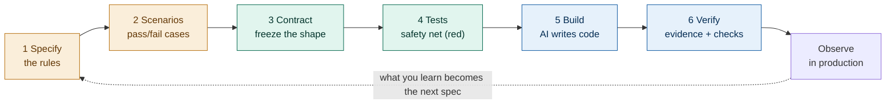

# 02 · The flow, and what is disposable

[← 01 Core principles](./01-principles.md) · [Contents](./README.md) · Next: [03 Step 1 Specify →](./03-step-1-specify.md)

---

## The flow

AIDD is one repeatable flow of six steps, followed by an observation loop. People perform the first four steps (with AI assistance), the AI performs the fifth (under direction), and people perform the sixth.




```text
  人 human-led ───────────────►│◄─────────── machine-led ──► 人 verify
  1 Specify → 2 Scenarios → 3 Contract → 4 Tests → 5 Build → 6 Verify
                              (freeze)    (red)     (AI)      (people)
                                                                  │
                            observe in production  ◄──────────────┘
                                   │
                                   └──► becomes the next Specify
```

The shape is deliberate: the human-led steps establish direction, a frozen contract forms the seam in the middle, and the AI-led build runs fast and safely on the far side because everything it needs is already fixed.

## Why the order is the order

Each step produces exactly one artifact, and each artifact is the input to the next step. The order is not a preference; it is a dependency chain.

| Step | Produces | Which is needed by |
|------|----------|--------------------|
| 1 Specify | the rules | scenarios, and everything after |
| 2 Scenarios | pass/fail cases | the tests |
| 3 Contract | the fixed shape | the tests and the build |
| 4 Tests | the failing safety net | the build and the verification |
| 5 Build | the code | the verification |
| 6 Verify | a trusted, releasable change | the release and the next loop |

The single rule of discipline follows directly: **do not begin a step until the previous artifact exists.** Skipping forward means the AI builds against a guess.

## Who does what

| Step | Person's job | AI's job |
|------|--------------|----------|
| 1 Specify | decide and confirm the rules | draft; list assumptions to confirm |
| 2 Scenarios | decide what "correct" looks like | draft scenarios |
| 3 Contract | approve and freeze the shape | generate the contract and mocks |
| 4 Tests | set the targets | generate failing tests |
| 5 Build | direct in small batches | implement until tests pass |
| 6 Verify | confirm via evidence + judgment | (none — this is the human check) |

## What survives, and what is disposable

This is the idea that most distinguishes AIDD from older practice.

**The artifacts are the durable asset.** The specification, the scenarios, the contract, and the tests capture decisions and meaning. They are what you protect, version, and carry forward.

**The code is disposable.** It is one implementation that satisfies the artifacts. If a better approach appears, or the AI model improves, the code can be regenerated against the same artifacts without loss.

A practical test of whether a team has absorbed this: ask what they would be upset to lose. If the answer is "the code," they are still working the old way. If the answer is "the contracts and the tests," they are working in AIDD.

> **Do:** invest in clear, stable specs, contracts, and tests.
> **Don't:** measure progress by how much code was generated or reused — that counts the cheap, disposable thing.

## How the rest of Part II is organized

Each of the next seven chapters takes one step (and then the loop) and gives it the same treatment: its purpose, who does it, the artifact it produces, the AI prompt that drives it, the exit check that says it is done, and what to do when that check fails. The running example continues throughout.
